School managment system feature list
====================================

#### Dasboard
-------------
* __Total classes__
* __Number of students__
* __number of subjects__
* __show attendence__
* __exams__

#### Student admission system 
-----------------------------
* __Fully functional and automated admission form for student enrolment__

* __Enroll students to a specific class and section for a certain session__

#### Class-wise subject management  
----------------------------------
* __Add subjects for each class separately__

#### Student promotion 
-----------------------
* __promote a student from one class to another__

#### Students’ daily attendance  
-------------------------------
* __Take attendance of students daily__
* __Keep track if students are absent__


#### Students’ attendance report  
---------------------------------
* __Get a well defined attendance report for all students of a certain class for a certain month__

#### Exam evaluations or marks management   
------------------------------------------
* __Evaluate or put exam marks for each student subject wise__
* __Compare students’ marks__
* __Print student mark sheet__

#### Students’ fees management   
-------------------------------
* __Create invoice for student fees__
* __Automatically send fees notification to specific date whose set in amdin__

#### Academic year or session handling    
---------------------------------------
* __Keep your school records year-wise__
* __Ability to select academic sessions__
* __Ability to see previous session data__

#### Management of teachers     
----------------------------
* __Add/edit/delete teachers anytime you need__
* __Assign teacher to specific class or section__
* __Assign teacher to specific subject__

#### Customization of school information    
-----------------------------------------
* __Change school name and other information from system settings__

#### Teacher Panel    
-------------------
* __teacher show dasboard attendence and teachers portion__


** First git clone

```
 http://devel.ictinnovations.com/git/ict/school.git
```
**Change configuration according your need and create Database**

```
$ php artisan migrate
```
```
$ php artisan db:seed
```
```
$ php artisan passport:install (for restfull Api)
```
```
$ php artisan storage:link
```
```
$ php artisan serve --port 8080
```
**  http://localhost:8080 **
```
$ php artisan storage:link

```
## cron job Settings
```
crontab -e

* * * * * /usr/bin/php7.1 /path/artisan schedule:run 1>> /dev/null 2>&1

```
# Screenshot
============

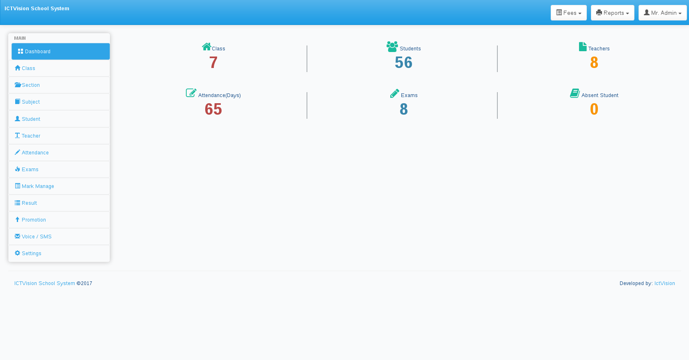
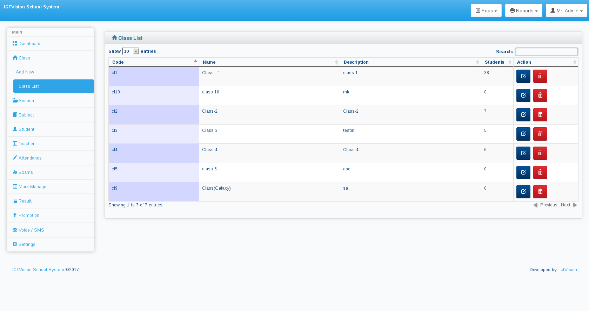
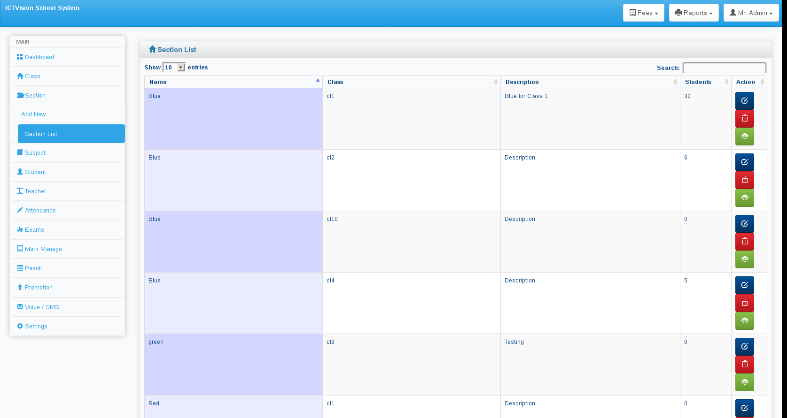
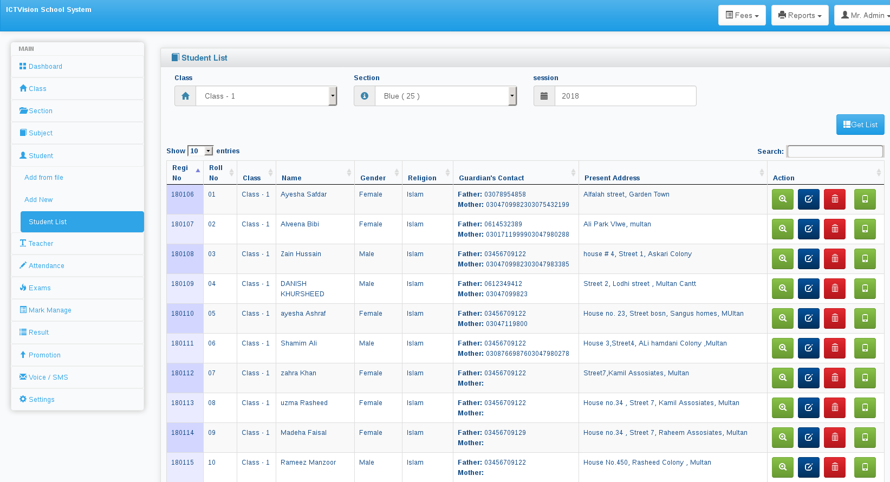
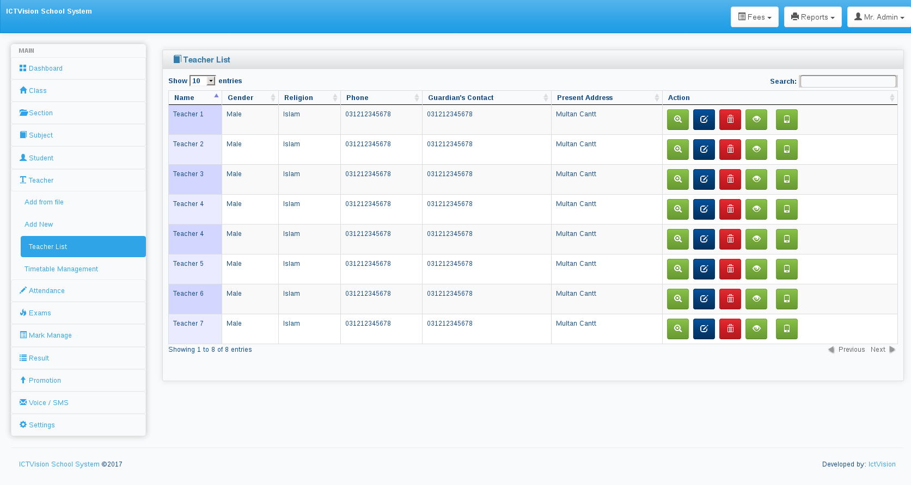
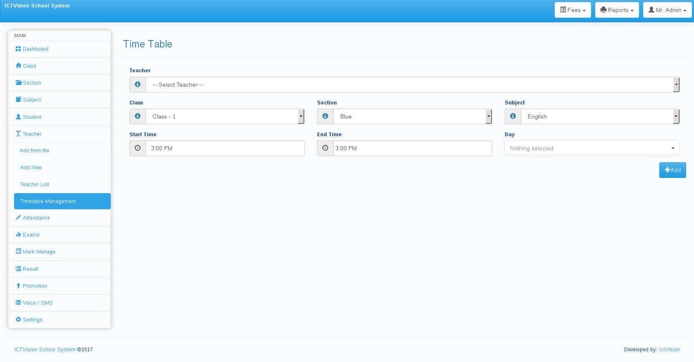
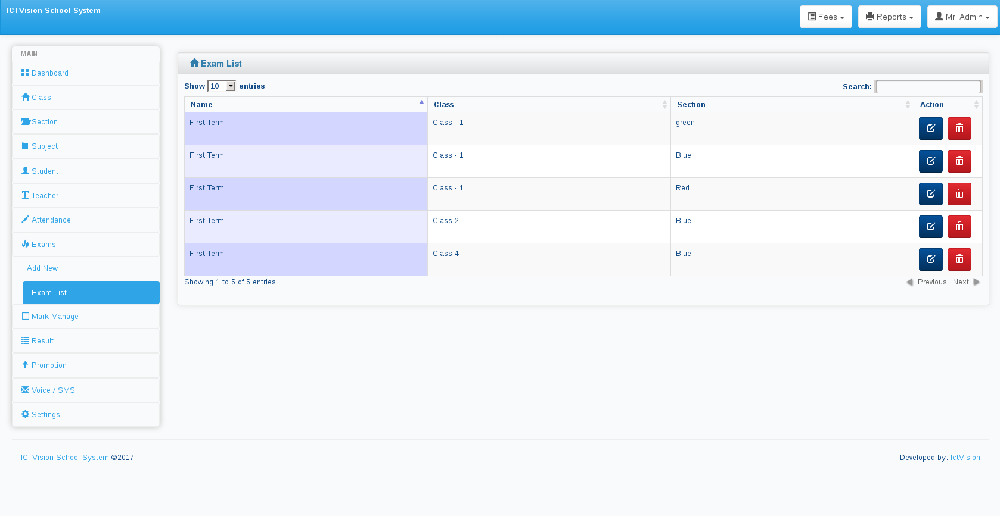
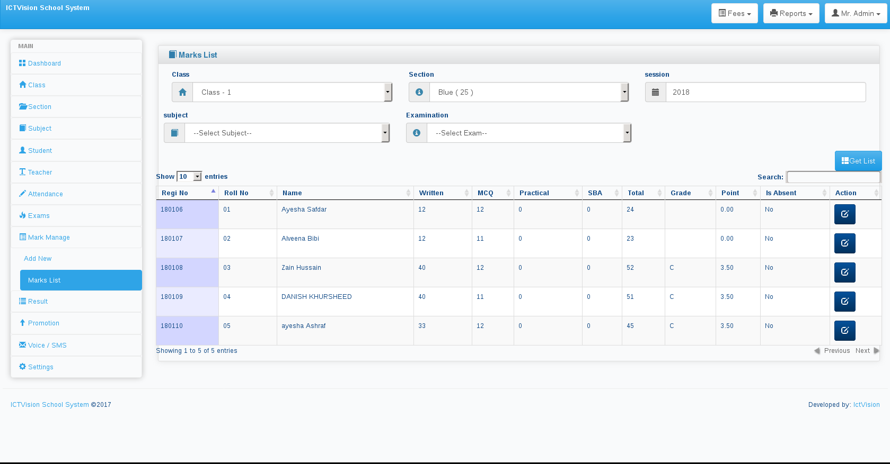
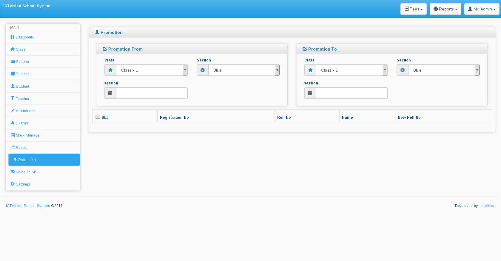
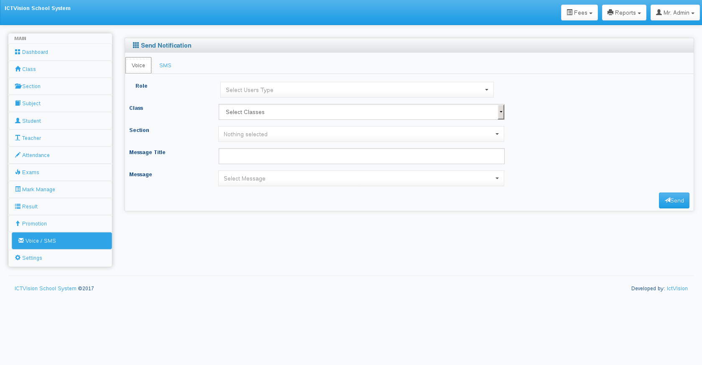
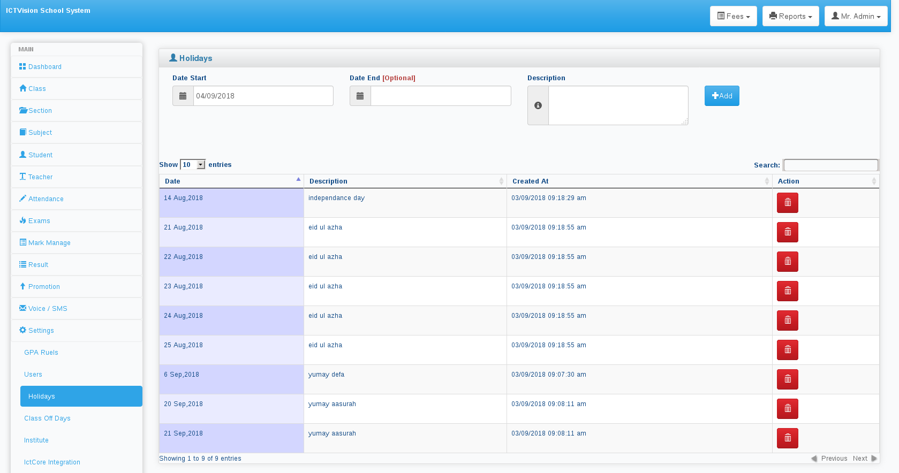
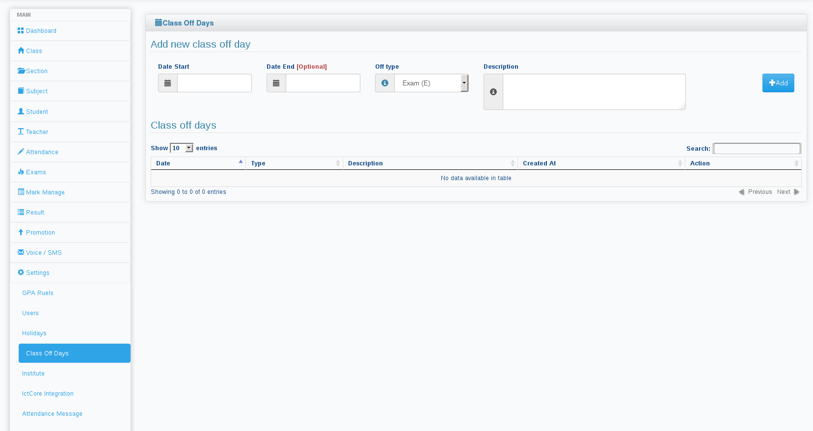
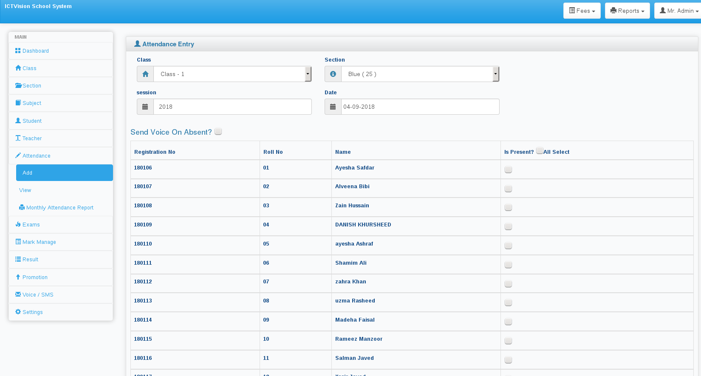
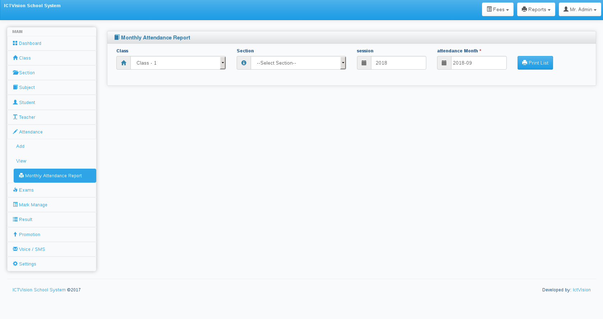
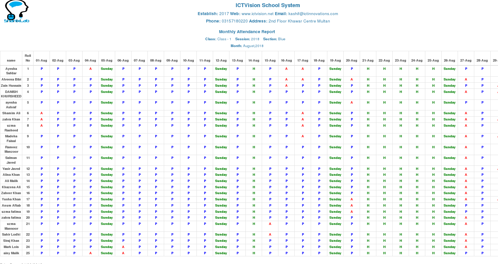

System Dependencies
===================
* PHP >=7
* OpenSSL PHP Extension
* PDO PHP Extension
* Mbstring PHP Extension
* Tokenizer PHP Extension
* XML PHP Extension


